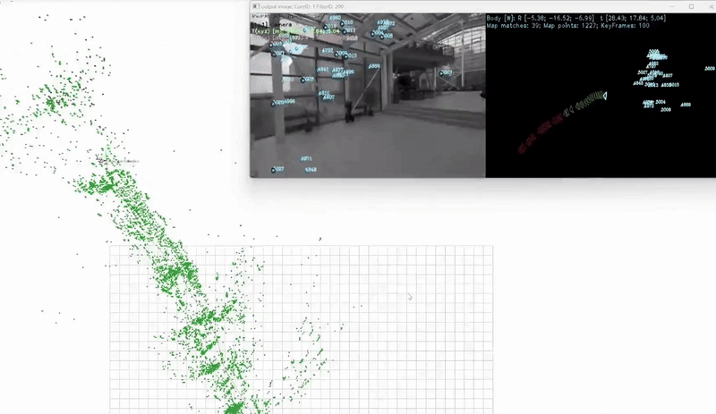

# CyberCortex.AI.CyC_SLAM

<!-- markdownlint-disable first-line-h1 -->
<!-- markdownlint-disable html -->
<!-- markdownlint-disable no-duplicate-header -->

  

  

 

  

## 1. Introduction
CyberCortex.AI.CyC_SLAM is a visual-inertial RGBD Simultaneous Localization and Mapping (SLAM) system.

Designed for cutting-edge robotics, autonomous vehicles, and AR/VR applications, our SLAM solution seamlessly fuses sensor data from inertial sensors, depth and rgb cameras, delivering ultra-precise localization even in dynamic, GPS-denied environments. Leveraging advanced AI-driven feature extraction, loop closure detection, and real-time optimization, our algorithm ensures drift-free mapping with minimal computational overhead. Its adaptive architecture scales effortlessly across platforms, from lightweight embedded systems to high-performance computing clusters. Whether enhancing robotic navigation, enabling immersive augmented reality, or revolutionizing industrial automation, our SLAM technology is the key to unlocking next-generation autonomy with reliability you can trust.

## 2. Demo
Contact us for further details [contact@cybercortex.ai](contact@cybercortex.ai).
